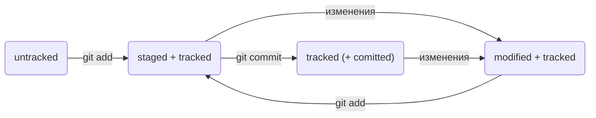

# Шпаргалка по Git

## Основные понятия
- `Ветка` - параллельная версия репозитория
- `Коммит` - фиксация изменений в локальный репозиторий
- `Рабочее дерево` - иерархия папок и файлов репозитория, относящихся к проекту
- `Репозиторий` - папка с файлами проекта, изменения в которой записываются и отслеживаются Git

## Основные команды
- `git init` - создать репозиторий
```bash
cd ~/dev/first-project # перешли в нужную папку
git init # создали репозиторий
```
- `rm -rf .git` - «разгитить» папку
```bash
cd ~/dev/first-project # перешли в нужную папку
rm -rf .git # удалили скрытую подпапку .git
```
- `git status` - проверить состояние репозитория
    + `staged` - "Changes to be committed: ..." в выводе;
    + `modified` - "Changes not staged for commit: ..." в выводе;
    + `untracked` - "Untracked files: ..." в выводе.

См. также `Статусы файлов в репозитории`
- `git add` - добавить изменённые файлы к коммиту
```bash
git add readme.txt # подготовить файл readme.txt к сохранению в репозитории
git add . # подготовить все файлы текущей папки к сохранению в репозитории
git add --all # подготовить все файлы рабочего дерева к сохранению в репозитории
```
- `git commit` - сохранить подготовленные изменения в репозитории
```bash
git commit -m 'Комментарий к коммиту'
```
- `git log ` - посмотреть историю коммитов. Запись лога содержит в себе:
    + строку из цифр и латинских букв после слова commit — это хеш коммита;
    + Author — имя автора и его электронная почта;
    + Date — дату и время создания коммита;
    + сообщение коммита (комментарий к коммиту).

Нажать `Q` для выхода.
- `git log --oneline` - посмотреть сокращённую историю коммитов
Каждый коммит - одной строкой.
Хэш не полный, а только первые несколько символов. Сокращённые хэши уникальны.
- `git config --global user.name "[имя]"` - установить имя автора для выполняемых коммитов
- `git config --global user.email "email address"` - установить адрес электронной почты автора для выполняемых коммитов

## Коммиты
- снимки состояния, снэпшоты
- идентификатор коммита - хэш SHA-1, уникален в пределах репозитория
- HEAD - ссылка (указатель) на последний (самый новый) коммит; служебный файл в подпапке .git

### Сообщения (комментарии) к коммитам


## Статусы файлов в репозитории
- `untracked` - ещё не добавленный через `git add`
- `tracked` - добавленный через `git add`, на любом из последующих этапов
- `staged` (aka `indexed`, `cached`) - добавленный к коммиту через `git add`, но ещё не сохранённый через `git commit` (готов к коммиту)
- `modified` - изменённый после последнего выполнения `git add` или `git commit`, но ещё не в переведённый статус `staged` через `git add`

### Жизненный цикл файла в репозитории




## Работа с удалённым репозиторием на GitHub
### Первичное связывание локального и удалённого репозиториев
1. Связать репозитории
```bash
cd ~/dev/first-project
git remote add origin git@github.com:%ИМЯ_АККАУНТА%/first-project.git
```
`origin` (англ. «источник») — стандартный псевдоним, с помощью которого можно обращаться к главному удалённому репозиторию.

2. Переименовать основную ветку в локальном репозитории
```bash
git branch -M main
```

3. Связать ветки
```bash
git push -u origin main # Если команда приведёт к ошибке, попробуйте заменить main на master
```
### Синхронизация изменений между локальным на удалённым репозиториями
- `git push` - синхронизировать изменения из локального репозитория на удалённый
```bash
git add .
git commit -m 'COMMENT'
git push # краткая форма, поразумевается текущий удалённый репозиторий и текущая ветка
git push origin main # полная комманда, с указанием удалённого репозитория и ветки
```
- `git pull` - синхронизировать изменения из удалённого репозитория на локальный
